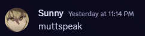
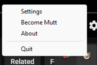
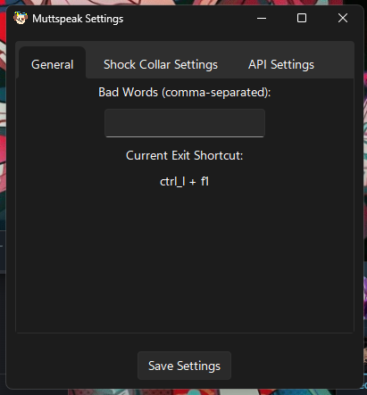
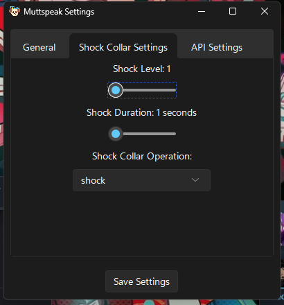
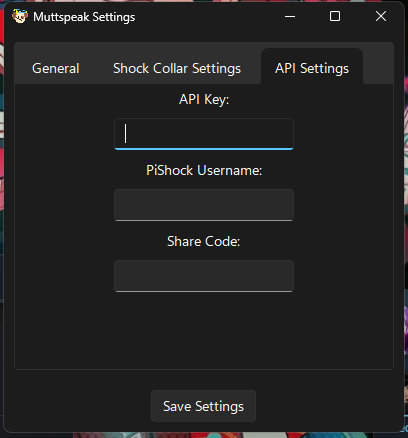

<br />
<div align="center">
  <a href="https://github.com/MegaGeese/muttspeak">
    
  </a>

<h3 align="center">muttspeak</h3>

  <p align="center">
    A way to keep your language clean
    <br />
    <a href="https://github.com/MegaGeese/muttspeak/issues/new?labels=bug&template=bug-report---.md">Report Bug</a>
    &middot;
    <a href="https://github.com/MegaGeese/muttspeak/issues/new?labels=enhancement&template=feature-request---.md">Request Feature</a>
  </p>
</div>


<!-- TABLE OF CONTENTS -->
<details>
  <summary>Table of Contents</summary>
  <ol>
    <li>
      <a href="#about-the-project">About The Project</a>
      <ul>
        <li><a href="#built-with">Built With</a></li>
      </ul>
    </li>
    <li>
      <a href="#getting-started">Getting Started</a>
      <ul>
        <li><a href="#prerequisites">Prerequisites</a></li>
        <li><a href="#installation">Installation</a></li>
        <li><a href="#build from source">Build from Source</a></li>
      </ul>
    </li>
    <li><a href="#usage">Usage</a></li>
    <li><a href="#roadmap">Roadmap</a></li>
    <li><a href="#contact">Contact</a></li>
  </ol>
</details>


<!-- ABOUT THE PROJECT -->
## About The Project

[](https://github.com/MegaGeese/muttspeak)

<p align="right">(<a href="#readme-top">back to top</a>)</p>

### Prerequisites

Own a PiShock

### Installation

1. Get an API Key from PiShock
2. Download the latest portable executable from [Releases](https://github.com/MegaGeese/muttspeak/releases)

### Build from Source
Alternatively you may also build from source using the following commands
1. install the required pip packages 
```bash
pip install pystray Pillow pywinstyles pynput json threading requests sv_ttk tkinter pystray
```
2. build the application
```bash
python -m PyInstaller --onefile --noconsole --icon='./icon.ico' --add-data "icon.png:." -n muttspeak .\main.py
```

<p align="right">(<a href="#readme-top">back to top</a>)</p>

<!-- USAGE EXAMPLES -->
## Usage

This app is essentially a keylogger (doesnt actually "log" any keys) that will administer a shock to a PiShock collar if a keyword is typed

This app does not open a window by default. It will launch in your system tray where you can access settings, enable mutt mode (begins logging), and exit the app

<div align="center">
    
</div>

Add bad words, api connection settings, and configure your shock level/duration in the settings menu


<div align="center">
    
    
    
</div>

_For more examples, please refer to the [Documentation](https://example.com)_

<p align="right">(<a href="#readme-top">back to top</a>)</p>


<!-- ROADMAP -->
## Roadmap

- [ ] Speach to text 
- [ ] Bad Words URL

See the [open issues](https://github.com/MegaGeese/muttspeak/issues) for a full list of proposed features (and known issues).

<p align="right">(<a href="#readme-top">back to top</a>)</p>

<!-- CONTACT -->
## Contact

Goose - [@MegaGeese](https://twitter.com/megageese)

<p align="right">(<a href="#readme-top">back to top</a>)</p>

